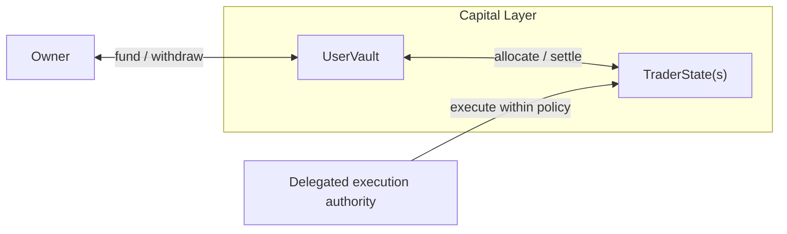

# stellalpha_vault

`stellalpha_vault` is the on-chain vault and strategy-state program planned to power Stellalpha's mainnet execution layer.

This repository is best read as a **protocol component**, not as a product surface. The main Stellalpha app handles discovery, demo-vault UX, and simulated execution. `stellalpha_vault` is the capital-control layer intended to enforce that lifecycle on-chain once the mainnet vault is ready.

At the same time, the design is not only useful to Stellalpha. The vault model can also be repurposed anywhere a system needs user-owned capital, delegated execution, isolated strategy state, and owner-controlled withdrawal.

## At A Glance

| Item | Description |
| --- | --- |
| Repository role | Planned mainnet capital layer for Stellalpha |
| Repository type | Anchor program / protocol dependency |
| Core model | User vault -> trader states |
| Intended execution model | Delegated, policy-constrained Jupiter swaps |
| Intended custody model | Non-custodial principal with owner-controlled withdrawal |
| Current state | In development, not yet integrated into the main app, not yet at final mainnet posture |

## Repository Role

Within Stellalpha, this repository is meant to do one job well: define **who owns capital, who can execute strategy logic, and what cannot leave user control**.

That makes it different from the main app:

- the app expresses the product flow
- the demo vault proves the lifecycle in simulation
- `stellalpha_vault` is meant to enforce the capital and permission boundary on-chain

So this repo is part of Stellalpha, but it naturally reads more like a reusable protocol dependency than a public-facing application.

## Contract Model

The contract is built around a **vault -> trader states** structure.

The diagram is intentionally abstract. It matches the intended architecture in the contract and the hardening plan: the owner remains the capital owner, the vault is the base account, trader states isolate per-trader allocations, and delegated authority operates only inside that trader-state layer. The Jupiter-only and policy-constrained execution model is part of the intended production boundary, but it is better expressed in prose than as extra diagram nodes here.

Each layer has a different responsibility:

| Primitive | Role |
| --- | --- |
| `UserVault` | The owner's base capital account and trust boundary anchor. |
| `TraderState` | An isolated allocation state for a specific followed trader or strategy. |
| Delegated execution authority | The protocol authority intended to execute approved swaps inside active trader states. |
| Owner withdrawal path | The path through which principal is intended to return to the owner wallet. |

This model is useful because it separates capital ownership from execution while still keeping allocation, settlement, and exit explicit.

## Why Stellalpha Uses This Shape

Stellalpha is not meant to mirror raw wallets forever. The long-term model is closer to **managed strategy execution without surrendering custody**.

The vault -> trader states structure supports that by making the lifecycle explicit:

- capital enters the user vault
- trader-specific allocations are created intentionally
- execution happens inside isolated trader states
- positions can be paused, settled, and exited cleanly
- principal returns through owner-controlled withdrawal paths

That is the same lifecycle the main app already demonstrates in demo form. This contract is meant to become the on-chain version of that model.

## Intended Trust Boundary

The intended production boundary is:

| Capability | Vault owner | Stellalpha execution authority | Meaning |
| --- | --- | --- | --- |
| Create the vault and assign delegated execution authority | Yes | No | The user defines the trust boundary. |
| Deposit or add capital | Yes | No | Capital enters under owner control. |
| Withdraw or redeem principal back to the owner wallet | Yes | No | Only the owner should be able to take capital out. Stellalpha should not be able to redeem, withdraw, or drain user funds. |
| Pause or stop strategy activity | Yes | Yes | Either side should be able to halt execution for safety. |
| Open, close, settle, and exit trader allocations | Yes | No | Strategy lifecycle remains owner-controlled. |
| Execute approved Jupiter swaps inside active trader states | No* | Yes | Stellalpha gets execution authority, not custody authority. |
| Send principal to an arbitrary external wallet | No | No | Principal should stay inside the vault and trader-state policy envelope. |

\* Unless the owner is also set as the delegated authority. In Stellalpha's intended production model, execution authority and withdrawal authority remain separate.

## Current Implementation State

The current contract already reflects a meaningful part of the target design:

- separate `UserVault` and `TraderState` account types
- owner-gated deposit and withdrawal flows
- trader-state lifecycle primitives
- delegated execution through `execute_trader_swap`
- multi-asset trader-state support

But this repository should still be read as **in-progress infrastructure**, not as a finished mainnet vault.

The main gaps are:

- the legacy `execute_swap` path still exists
- delegated execution is still broader than the intended Jupiter-only boundary
- destination and authority constraints still need tightening before the strongest non-custodial claim is justified

So the current state is:

- the architecture is clear
- the contract direction is aligned with Stellalpha
- the hardening work is still ongoing

## Reuse Beyond Stellalpha

Although this repository is being developed for Stellalpha, the pattern is broader than copy trading.

It can also fit systems that need:

- user-owned capital accounts
- delegated but constrained execution
- isolated per-strategy state
- explicit settlement and exit
- a clear separation between automation and custody

That makes `stellalpha_vault` useful not only as Stellalpha's planned capital layer, but also as a reusable design pattern for delegated on-chain execution more generally.

## Development Direction

The current direction toward a production-ready mainnet vault is:

- remove or permanently disable the legacy execution surface
- restrict execution to the final Jupiter-only model
- finalize policy-constrained swap authority
- tighten destination-account and authority boundaries
- integrate the vault into the main Stellalpha app once the model is ready

## Status

| Dimension | Current read |
| --- | --- |
| Intended role | Stellalpha's final mainnet vault layer |
| Current role | In-progress implementation of that layer |
| Product relationship | Protocol dependency of the main app |
| Reusability | Can be adapted outside Stellalpha |
| Security posture | Not yet at final mainnet posture |
| Integration status | Not yet integrated into the public app |

## Related Links

- **Main app**: [stellalpha.xyz](https://stellalpha.xyz)
- **Main app repo**: [stellalpha](https://github.com/akm2006/stellalpha)
- **DoraHacks**: [dorahacks.io/buidl/32072](https://dorahacks.io/buidl/32072)
- **X**: [@stellalpha_](https://x.com/stellalpha_)

## License

Distributed under the MIT License. See `LICENSE` for more information.
